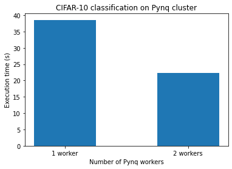

# Distributed PYNQ

This repository demonstrates the usage of a cluster of Pynq-Z1 boards to parallelize an image classification task. Dask (https://dask.org/) is used to coordinate the cluster, and perform data dispatch and collection.
The original (single-Pynq board) example is available at https://github.com/Xilinx/BNN-PYNQ


This repo contains the steps to replicate this task and a sample notebook. It has been tested on a Macbook with Python version `3.6.5`, but should work on any machine with Python.

## Steps to run
- On the host machine, install dask and dask-distributed using :

    ```pip install dask==2.14.0```

    ```pip install distributed==2.14.0```


- Copy `requirements.txt` from this repo onto the Pynq board, for example using SCP:

    ```scp requirements.txt xilinx@192.168.2.99:/home/xilinx```

    Installing the Bnn-Pynq requires the BOARD env variable to be set. SSH into the Pynq board and run as sudo:

    ```shell
    echo export BOARD=Pynq-Z1 >> /root/.bashrc && source /root/.bashrc
    sudo pip3 install -r requirements.txt
    ```

- Note that if you are connecting more than 1 Pynq boards, each of them will have to be assigned a unique IP address. This can be done by modifying the default value `192.168.2.99` to something else (`192.168.2.100` etc.) in `/etc/network/interfaces.d/eth0`

- Run a dask-scheduler on a host machine (Replace the IP with the host's IP on the local network with the Pynq boards):

    ```dask-scheduler --host 192.168.2.1```

- On each of the Pynq boards, start a dask-worker (replace the IP with the scheduler IP obtained from the previous command):

    ```dask-worker tcp://192.168.2.1:8786 --no-nanny --nthreads 1```

- Run the `distributed-pynq.ipynb` Jupyter notebook in this repo on the host machine. It will download the dataset, and run it on the connected Pynq boards.

## Performance comparision 


## Multi-device

- We can also use Dask to parallelize our task if multiple different boards/devices are attached to the same server. See the `multi-device-example.ipynb` example. 

NOTE: In this case, when starting the dask-worker, you have to specify which device/board you want to use like this:

```shell
export DEVICE=<name-of-device> && dask-worker <scheduler-ip> --no-nanny --nthreads 1
```

`<name-of-device>` (`xilinx_u200_xdma_201830_2` for example) can be obtained by running the following in the python3 interpreter on the server with the boards:

```python
from pynq import Device
for i in Device.devices:
    print(i.name)
```


## Using Arrow Tables 
- Dask implements custom serializers for specific data types (https://github.com/dask/distributed/tree/master/distributed/protocol), including Arrow Table and RecordBatch. These are used automatically if the data being distributed is of that data type (i.e., no code change is required from the dask user).

- In the notebook `dask-with-arrow.ipynb`, we compare performance for distributing a large csv as an Arrow Table and as a Pandas Dataframe. Dask's `scatter` operation is ~1.4x faster for Arrow as compared to pd.DataFrame. This is likely due to faster (de)serialization with Arrow.
